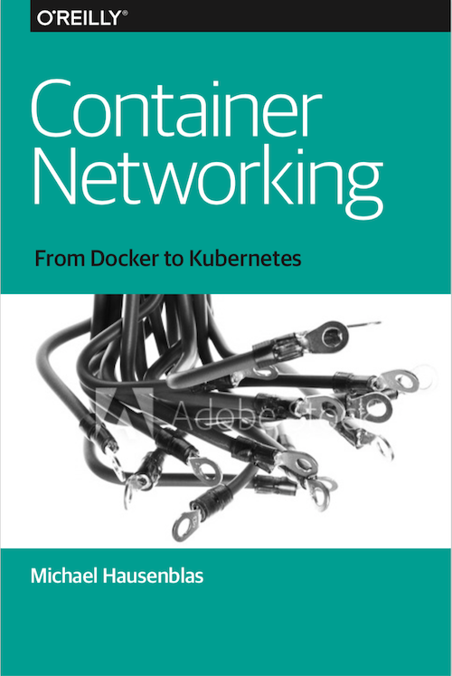

# Container Networking Reference

A collection of tools and references around container networking accompanying my O'Reilly book _Container Networking_.

- [Networking 101](#networking-101)
- [Linux kernel](#linux-kernel)
- [Docker](#docker)
- [Kubernetes](#kubernetes)
  - [Official documentation](#official-documentation)
  - [3rd-party articles](#3rd-party-articles)
- [Tooling](#tooling)
  - [SDN](#sdn)
  - [Proxies and load balancers](#proxies-and-load-balancers)
  - [Ingress and gateways](#ingress-and-gateways)
  - [Service Meshes](#service-meshes)
  - [Other](#other)

---

## Networking 101

- [Network Protocols](https://www.destroyallsoftware.com/compendium/network-protocols?share_key=97d3ba4c24d21147) Programmer's Compendium
- [Demystifying container networking](http://blog.mbrt.it/2017-10-01-demystifying-container-networking/) by Michele Bertasi
- [An Empirical Study of Load Balancing Algorithms](http://liblb.com/learn.html)

## Linux kernel

- [The History of Containers](http://red.ht/1mCDpJU)
- [A history of low-level Linux container runtimes](https://opensource.com/article/18/1/history-low-level-container-runtimes)
- [Networking in Containers and Container Clusters](http://wiki.iptables.org/pablo/netdev0.1/papers/Networking-in-Containers-and-Container-Clusters.pdf)
- [Anatomy of a Container: Namespaces, cgroups & Some Filesystem Magic](http://bit.ly/1SAn4RU) - LinuxCon
- [Network namespaces](https://lwn.net/Articles/219794/)
- [Network classifier cgroup](https://www.kernel.org/doc/Documentation/cgroup-v1/net_cls.txt)
- [Exploring LXC Networking](http://bit.ly/1kMA2hE)
- [IPv6 and Containers: Why We Can't Have Nice Things (And How We Can)](https://www.youtube.com/watch?v=eF50OxZ5u4o)

## Docker

- [Docker Networking](http://bit.ly/1JXWf2R)
- [Concerning Containers’ Connections: on Docker Networking](http://bit.ly/1JXWfjl)
- [Unifying Docker Container and VM Networking](http://bit.ly/1JuCDs5)
- [Letting Go: Docker Networking and Knowing When Enough Is Enough](http://bit.ly/1TEXFVr)
- [The Tale of Two Container Networking Standards: CNM v. CNI](http://www.nuagenetworks.net/blog/container-networking-standards/)

## Kubernetes 

### Official documentation

- [Networking design](https://github.com/kubernetes/community/blob/master/contributors/design-proposals/network/networking.md)
- [Services](https://kubernetes.io/docs/concepts/services-networking/service/)
- [Administration—Cluster Networking](https://kubernetes.io/docs/concepts/cluster-administration/networking/)
- [Provide Load-Balanced Access to an Application in a Cluster](https://kubernetes.io/docs/tasks/access-application-cluster/load-balance-access-application-cluster/)
- [Create an External Load Balancer](https://kubernetes.io/docs/tasks/access-application-cluster/create-external-load-balancer/)
- [DNS for Services and Pods](https://kubernetes.io/docs/concepts/services-networking/dns-pod-service/)
- [Kubernetes DNS-Based Service Discovery](https://github.com/kubernetes/dns/blob/master/docs/specification.md)
- [Kubernetes DNS example](https://github.com/kubernetes/examples/blob/master/staging/cluster-dns/README.md)
[Network policies](https://kubernetes.io/docs/concepts/services-networking/network-policies/)
- [Issue 44063](https://github.com/kubernetes/kubernetes/issues/44063): Implement IPVS-based in-cluster service load balancing

### 3rd-party articles

- [Deep Dive Envoy and Istio Workshop](http://blog.christianposta.com/microservices/deep-dive-envoy-and-istio-workshop/) by Christian Posta 
- [Getting started with Conduit - lightweight service mesh for Kubernetes](https://abhishek-tiwari.com/getting-started-with-conduit-lightweight-service-mesh-for-kubernetes/) by Abhishek Tiwari
- [Ingress survey 2018](https://github.com/bowei/k8s-ingress-survey-2018) by SIG Network
- [Kubernetes Services By Example](https://blog.openshift.com/kubernetes-services-by-example/)
- [Tutorials and Recipes for using Kubernetes Network Policies feature](https://github.com/ahmetb/kubernetes-network-policy-recipes) by Ahmet Alp Balkan
- [Data and analysis of the Kubernetes Ingress survey 2018](https://github.com/bowei/k8s-ingress-survey-2018) by the Kubernetes SIG Network
- [Kubernetes Networking 101](https://www.slideshare.net/weaveworks/kubernetes-networking-78049891) by Bryan Boreham of WeaveWorks
- [Illustrated Guide To Kubernetes Networking](https://speakerdeck.com/thockin/illustrated-guide-to-kubernetes-networking) by Tim Hockin of Google
- [The Easy--Don't Drive Yourself Crazy--Way to Kubernetes Networking](https://www.youtube.com/watch?v=H5Zl_kDOwBU) by Gerard Hickey (KubeCon 2017, Austin) 
- Blog post series by Mark Betz:
  - [Understanding kubernetes networking: pods](https://medium.com/google-cloud/understanding-kubernetes-networking-pods-7117dd28727)
  - [Understanding kubernetes networking: services](https://medium.com/google-cloud/understanding-kubernetes-networking-services-f0cb48e4cc82)
  - [Understanding kubernetes networking: ingress](https://medium.com/google-cloud/understanding-kubernetes-networking-ingress-1bc341c84078)
- [Understanding CNI (Container Networking Interface)](http://www.dasblinkenlichten.com/understanding-cni-container-networking-interface/) by Jon Langemak
- [Operating a Kubernetes network](https://jvns.ca/blog/2017/10/10/operating-a-kubernetes-network/) by Julia Evans
- [The Service Mesh: Past, Present, and Future](https://www.youtube.com/watch?v=2trOvMUuLkk) by William Morgan (KubeCon 2017, Austin)
- [Meet Bandaid, the Dropbox service proxy](https://blogs.dropbox.com/tech/2018/03/meet-bandaid-the-dropbox-service-proxy/) by Dmitry Kopytkov
- [Kubernetes NodePort vs LoadBalancer vs Ingress? When should I use what?](https://medium.com/google-cloud/kubernetes-nodeport-vs-loadbalancer-vs-ingress-when-should-i-use-what-922f010849e0) by Sandeep Dinesh
- [OpenShift custom router with TCP/SNI support](https://blog.zhaw.ch/icclab/openshift-custom-router-with-tcpsni-support/)

## Tooling

### SDN

- [canal](https://github.com/projectcalico/canal): policy-based networking for cloud native applications (see also Project Calico)
- [Cilium](https://github.com/cilium/cilium): secure network connectivity and loadbalancing based on BPF
- [Contiv](http://contiv.github.io/): unifies containers, VMs, and bare metal with a single networking fabric
- [Contrail](https://www.juniper.net/us/en/products-services/sdn/contrail/contrail-networking/): commercial SDN by Juniper (see also Tungsten Fabric)
- [flannel](https://coreos.com/flannel/docs/latest/): virtual network that gives a sub-net to each host for use with a container runtime
- [Open vSwitch](http://openvswitch.org/): multilayer virtual switch supporting standards such as NetFlow, sFlow, IPFIX, RSPAN, CLI, LACP, 802.1ag
- [OpenVPN](https://openvpn.net/): open source VPN
- [Project Calico](http://www.projectcalico.org/): provides secure network connectivity by managing a flat layer 3 network, using IP-in-IP tunneling or overlays such as flannel
- [Tungsten Fabric](https://tungstenfabric.io/): network virtualization for providing connectivity and security for virtual, containerized or bare-metal workloads
- [Weave Net](https://www.weave.works/oss/net/): cloud native networking toolkit that creates virtual networks, enables automatic discovery and offers DNS, IPAM, and a distributed virtual firewall

### DNS

- [CoreDNS](https://coredns.io/): a DNS server written in Go
- [kubernetes-incubator/external-dns](https://github.com/kubernetes-incubator/external-dns): configure external DNS servers (AWS Route53, Google CloudDNS and others) for Ingresses and services
- [Kubernetes DNS](https://github.com/kubernetes/dns): part of Kubernetes proper, schedules a DNS pod and service, and configures the `kubelet`s to tell individual containers to use the DNS Service’s IP to resolve DNS names
- [SkyDNS](https://github.com/skynetservices/skydns): a distributed service for announcement and discovery of services built on top of etcd
- [WeaveDNS](https://www.weave.works/docs/net/latest/tasks/weavedns/weavedns/): a DNS server answering name queries on a Weave network

### Proxies and load balancers

- [coreos/corelb](https://github.com/coreos/corelb): a loadbalancer built on coreinit and NGINX
- [Envoy](https://www.envoyproxy.io/): cloud-native proxy supporting HTTP/2 and gRPC
- [HAProxy](http://www.haproxy.org/): load balancing and proxying for TCP and HTTP-based apps
- [kube-proxy](https://kubernetes.io/docs/reference/generated/kube-proxy/): Kubernetes built-in East-West traffic service proxy (managing IPtables entries)
- [MetalLB](https://metallb.universe.tf/): a load-balancer implementation for bare metal Kubernetes clusters using ARP, NDP, or BGP.
- [NGINX Reverse Proxy](https://docs.nginx.com/nginx/admin-guide/web-server/reverse-proxy/): configuring NGINX as a reverse proxy
- [Træfik](https://traefik.io/): a HTTP reverse proxy and load balancer

### Ingress and gateways

- [Ambassador](https://www.getambassador.io/): a Kubernetes-native API gateway built on Envoy
- [Contour](https://github.com/heptio/contour): a Kubernetes Ingress controller for Envoy
- [coreos/alb-ingress-controller](- https://github.com/coreos/alb-ingress-controller
): a Kubernetes Ingress Controller for AWS ALB 
- [kube-router](https://www.kube-router.io/): IPVS-based service proxy, Network Policy  controller
- Kubernetes [Ingress](https://kubernetes.io/docs/concepts/services-networking/ingress/) controllers:
  - [kubernetes/ingress-gce](https://github.com/kubernetes/ingress-gce/)
  - [kubernetes/ingress-nginx](https://github.com/kubernetes/ingress-nginx)
  - [nginxinc/kubernetes-ingress](https://github.com/nginxinc/kubernetes-ingress)
  - [zlabjp/nghttpx-ingress-lb](https://github.com/zlabjp/nghttpx-ingress-lb)

### Service Meshes

- [Conduit](https://conduit.io/): an ultralight service mesh for Kubernetes
- [Istio](https://istio.io/): an open platform to connect, manage, and secure microservices
- [Linkerd](https://linkerd.io/): a transparent proxy to be deployed as a service mesh

### Other

- [controlplaneio/netassert](https://github.com/controlplaneio/netassert): network security testing 
- [coreos/go-iptables](https://github.com/coreos/go-iptables): Go bindings for IPtables
- [coreos/matchbox](https://github.com/coreos/matchbox): network boot and provision Container Linux clusters
- [jetstack/cert-manager](https://github.com/jetstack/cert-manager/): automatically manage TLS certificates in Kubernetes
- [Skydive](http://skydive-project.github.io/skydive/): real-time network topology and protocols analyzer

